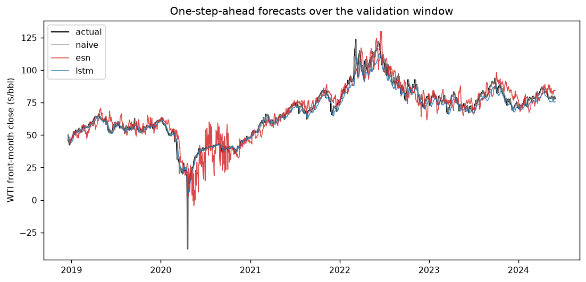
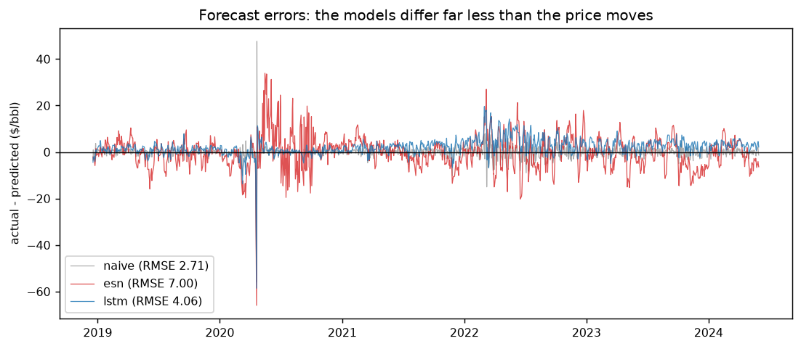
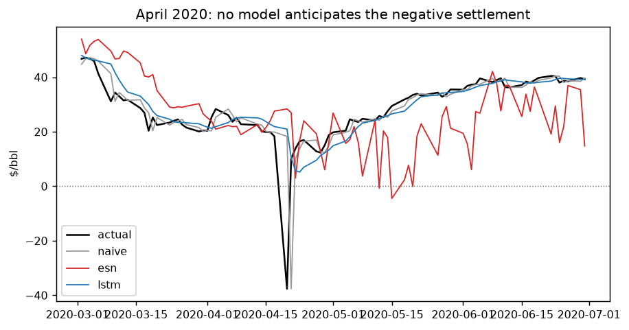
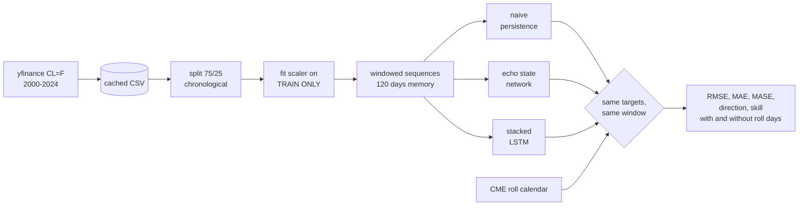

# WTI Crude Forecasting: LSTM vs. Echo State Network

[](https://github.com/vincal848/oil-price-prediction/actions/workflows/tests.yml)

For this project I was working from my coursework series in mathematical computing,
and I wanted to use neural networks on a price series. I took WTI Crude Oil Futures
(`CL=F`) and compared an LSTM against an Echo State Network reservoir model. My
reasoning for choosing a recurrent architecture over feedforward and convolutional
networks is in [docs/METHODS.md](docs/METHODS.md), along with the gate equations and
what the reservoir is actually doing.

I have since rebuilt it, and the conclusion changed. The original compared the two
models against each other and found the LSTM won. It did — but I never checked either
of them against the obvious benchmark, which is predicting that tomorrow's price is
today's price. **Both models lose to that benchmark, badly.** Everything below is the
work of establishing that.



*The naive forecast is on this chart. It is the grey line, and you cannot see it,
because it sits underneath the actual price for the entire window. That is the whole
problem with judging a one-step-ahead price model by eye.*

## At a glance

| | |
|---|---|
| **Data** | WTI front-month continuous (`CL=F`), 2000-08-30 to 2024-05-30, 5,962 daily closes |
| **Models** | Naive persistence; Echo State Network (ReservoirPy); stacked LSTM (TensorFlow) |
| **Split** | 75% train, chronological. Evaluation 2018-12-18 to 2024-05-30, 1,371 days |
| **Task** | One-step-ahead close, 120 trading days of memory |
| **Metrics** | RMSE, MAE, MASE, directional accuracy, skill vs. persistence |
| **Result** | Neither model beats persistence. LSTM 50% worse on RMSE, ESN 158% worse |
| **Stack** | Python, TensorFlow, ReservoirPy, scikit-learn, pandas |

## Results

| model | RMSE | MAE | MASE | directional accuracy | seconds |
|---|---|---|---|---|---|
| **naive persistence** | **2.71** | **1.36** | **1.35** | — | 0.0 |
| LSTM | 4.06 | 2.82 | 2.80 | 0.477 | ~94 |
| echo state network | 7.00 | 5.12 | 5.09 | 0.498 | ~0.05 |

Skill against persistence, where positive would mean an improvement:

| model | RMSE skill | MAE skill |
|---|---|---|
| LSTM | −0.496 | −1.077 |
| echo state network | −1.580 | −2.766 |

Three things follow from this.

**The LSTM does beat the ESN,** which is what the original concluded, and that part
holds up. It is about 42% better on RMSE. The reservoir, though, fits in a
twentieth of a second against the LSTM's ninety-odd -- three orders of magnitude,
which is the whole point of a fixed random reservoir with a trained readout. Here
it pays for that speed with a much noisier forecast.

**Neither beats doing nothing.** Persistence gets RMSE 2.71; the LSTM 4.06. A model
that costs 94 seconds of training and produces a worse forecast than copying
yesterday's number is not a model I would trade on. MASE says the same thing in
scale-free terms: both are well above 1.

**Neither has directional skill.** 0.477 and 0.498 against a coin flip. Level accuracy
on a near-random-walk is easy to obtain and tells you almost nothing, because most of
tomorrow's price is today's price. The direction of the move is the part with the
information in it, and neither model has any.



## Does the contract roll explain this?

`CL=F` is a continuous front-month series: when the front contract expires, Yahoo
splices the series onto the next one. The day-over-day change across a splice mixes a
real price move with the spread between two different contracts, and nothing can
forecast the second part. That is a genuine defect in the data and it was worth asking
whether it was compressing the comparison.

I derived the roll dates from the CME contract rule rather than detecting them from
the data, so they are known in advance and cannot be fitted to whatever happens to
look like a jump. The rule is three business days before the 25th of the month
preceding delivery, or four if that 25th is not a business day. The implementation is
checked against eight published termination dates in the test suite.

| | |
|---|---|
| Roll days | 285 of 5,961 (4.8%), 66 of them in the evaluation window |
| Mean absolute change, roll days | $1.34 |
| Mean absolute change, other days | $1.07 |
| Volatility ratio | 1.24× |
| Share of total variance | 5.3% |

So the roll is real, and roll days are about a quarter more volatile than ordinary
ones. But 4.8% of days carrying 5.3% of variance is barely over-represented, and
removing them does not change anything:

| model | RMSE skill, all days | RMSE skill, excluding roll days |
|---|---|---|
| LSTM | −0.496 | −0.485 |
| echo state network | −1.580 | −1.528 |

The roll moves the answer by about one percentage point. It is not what is compressing
the comparison. What compresses it is the task: one-step-ahead prediction of something
close to a random walk, where the benchmark is already most of the way to the answer.

A related point worth recording. I assumed the −$37.63 close on 2020-04-20 was a roll
artefact. It is not — it falls the day *before* that contract's termination, and
FRED's Cushing spot series, which has no contract and therefore no roll, went negative
the same day at −$36.98. That was a genuine collapse in the expiring contract under a
storage shortage, and no model here anticipates it.



## Returns, scored once out of sample

The results above frame the task as predicting the price level, which cannot beat
persistence. [docs/PROTOCOL.md](docs/PROTOCOL.md) fixes an honest test **before** any
return model was fitted: train to 2014, choose hyperparameters and the shrinkage weight
on 2015-2018, score 2019-01-02 to 2024-05-30 once, with expanding-window refits every
calendar quarter. Models predict the h-day log return and price = last * exp(r_hat), so
r_hat = 0 is persistence exactly. Horizons h = 1, 5, 20; for h > 1 only non-overlapping
targets are scored. Skill is `1 - RMSE/RMSE_persistence`; DM is a Diebold-Mariano test on
squared dollar error vs persistence with a Newey-West (HAC) variance; the direction
columns count the days the model calls a non-zero move, with a two-sided binomial test
against 0.5.

| h | model | n | RMSE | MAE | skill | DM p | dir. acc. | binomial p |
|---|---|---|---|---|---|---|---|---|
| 1 | persistence | 1359 | 1.851 | 1.284 | 0 | | | |
| 1 | random walk + drift | 1359 | 1.851 | 1.283 | -0.0002 | 0.570 | 0.536 | 0.009 |
| 1 | ridge (k=1, alpha=0.01) | 1359 | 1.852 | 1.286 | -0.0008 | 0.261 | 0.500 | 1.000 |
| 1 | w * ridge (w=1.00) | 1359 | 1.852 | 1.286 | -0.0008 | 0.261 | 0.500 | 1.000 |
| 5 | persistence | 272 | 4.055 | 2.907 | 0 | | | |
| 5 | random walk + drift | 272 | 4.058 | 2.906 | -0.0007 | 0.625 | 0.529 | 0.363 |
| 5 | ridge (k=20, alpha=100) | 272 | 4.055 | 2.906 | +0.0002 | 0.388 | 0.559 | 0.060 |
| 5 | w * ridge (w=1.00) | 272 | 4.055 | 2.906 | +0.0002 | 0.388 | 0.559 | 0.060 |
| 20 | persistence | 68 | 7.793 | 5.924 | 0 | | | |
| 20 | random walk + drift | 68 | 7.812 | 5.967 | -0.0025 | 0.673 | 0.485 | 0.904 |
| 20 | ridge (k=1, alpha=0.01) | 68 | 7.832 | 5.983 | -0.0049 | 0.060 | 0.471 | 0.716 |
| 20 | w * ridge (w=1.00) | 68 | 7.832 | 5.983 | -0.0049 | 0.060 | 0.471 | 0.716 |

**Nothing beats persistence significantly.** The largest skill is +0.02% (h=5), with
DM p = 0.39. The only small p-value in the directional columns is the drift baseline at
h=1 (binomial p = 0.009): it always calls "up", so it is scoring the share of up days
(53.6%), not forecasting skill, and it does not improve RMSE. The validation weight came out at w = 1.0 for every horizon (the clip at 1; the raw
least-squares weight was at or above 1), so the combination is identical to the ridge. The
ridge did show a tiny edge on validation (skill +0.26% at h=1, about 0 at h=5, +0.03% at
h=20) and it did not carry over to the holdout.

Sign strategy, h = 1, long/short by the sign of the ridge forecast, 2bp per side plus a
close-and-reopen on contract-roll days: gross -3.2% a year, net -8.7% a year, net Sharpe
-0.17. No edge.

Notes on the numbers:

- **Configurations tried: 48.** 15 ridge configurations (3 lag lengths x 5 alphas)
  x 3 horizons chosen on validation, plus the drift baseline at each horizon. The
  holdout was run once. Persistence and the weight fit are not counted as
  configurations. Before that single run I tried nothing on the holdout; the exploratory
  runs were on synthetic data in the tests.
- **2020-04-20** closes at -$37.63, so it has no log return. The two origins touching it
  (and lagged returns that involve it, set to 0) are skipped for every model alike.
- The h = 20 sample is 68 non-overlapping targets, so it has little power; the 5%-level
  statement is "cannot reject", not "equal".
- The continuous `CL=F` series splices contracts, so daily returns on roll days include
  a contract-spread jump no model can predict (see the roll section above).
- The LSTM and ESN were **not** reframed to returns. The ESN readout is already a ridge
  regression, the linear model above is the shrinkage-friendly version of the same idea,
  and it found nothing; an LSTM on the same returns is a bigger search for the same
  signal-free target. Add them only if a linear model ever shows skill.
- Evaluation checks (in `tests/test_forecast.py`): permuted returns give mean skill
  <= 0 across 10 seeds; planted AR(1) returns with phi = 0.1 give skill > 0 and DM
  p < 0.05; forecasts made at or before a date do not change when later prices change.

Reproduce with `python run.py --holdout` (writes `results/holdout.json`).

## Second attempt: public spread, basis and dollar information

[docs/PROTOCOL-2.md](docs/PROTOCOL-2.md) was committed before any post-May-2024 data was
downloaded. It declares a fresh holdout (2024-06-03 to 2026-10-08, 591 one-day targets,
scored once), six candidates chosen from economics (Brent-WTI spread, spot-vs-front
basis, dollar index, and combinations; FRED keyless CSVs `DCOILBRENTEU`, `DCOILWTICO`,
`DTWEXBGS`, all lagged one day), strong ridge shrinkage (alpha = 1000), a weight `w`
fit on 2019-2024 (already seen, so validation), quarterly expanding refits, and a
Bonferroni threshold of 0.05 / 6 = 0.0083.

**The validation weight was 0 for all six candidates**: on 2019-2024 every candidate's
forecast was uncorrelated or slightly anti-correlated with the next return (corr between
-0.056 and -0.003). The pre-declared shrunk forecasts are therefore persistence exactly:
skill 0.0000, nothing to test. To still look for signal, the table below shows the
unshrunk (w = 1) forecasts, a diagnostic I added after seeing w = 0; the same six
candidates, so the same Bonferroni threshold.

| model | RMSE | skill | DM p | dir. acc. | binomial p | sign strategy net / yr, Sharpe |
|---|---|---|---|---|---|---|
| persistence | 2.311 | 0 | | | | |
| random walk + drift | 2.311 | -0.0001 | 0.653 | 0.519 | 0.387 | |
| C1 spread | 2.311 | +0.0000 | 0.982 | 0.503 | 0.902 | -6.6%, -0.15 |
| C2 basis | 2.312 | -0.0003 | 0.127 | 0.473 | 0.202 | -46.8%, -1.07 |
| C3 dollar | 2.311 | +0.0003 | 0.431 | 0.554 | 0.0094 | +56.7%, +1.30 |
| C4 spread + basis | 2.312 | -0.0005 | 0.781 | 0.507 | 0.773 | +6.4%, +0.14 |
| C5 spread + basis + dollar | 2.312 | -0.0002 | 0.900 | 0.536 | 0.091 | +38.0%, +0.87 |
| C6 all + last return | 2.309 | +0.0008 | 0.685 | 0.524 | 0.266 | -3.4%, -0.08 |

**No candidate is significant.** No DM p-value is below 0.0083; RMSE differs from
persistence in the fourth decimal. The one tempting row is the dollar index: 55.4%
direction hits (binomial p = 0.0094, just above the 0.0083 threshold) and a sign
strategy Sharpe of 1.3. But its RMSE skill is +0.03% with DM p = 0.43, its validation
weight was 0, its Sharpe has a standard error near 0.65 over 2.4 years, and it is the
best of six sign strategies plus six direction tests. I read it as a lead for a future
untouched sample, not a result, and I did not tune anything around it.

Configurations tried in this protocol: 6 (plus the unshrunk diagnostic of the same
six). The earlier protocol used 48; together 54. The holdout of each protocol was read
once. Checks: `tests/test_forecast.py` has an exogenous null (permuted returns, skill
<= 0), a planted exogenous signal (skill > 0) and a one-day-lag test of the feature
builder (broken by removing the shift).

**Conclusion.** Against own-price returns (2019-2024) and against Brent-WTI spread, the
spot basis and the dollar (2024-2026), one-step WTI front-month forecasts do not beat
persistence in dollar error, and no directional edge survives the multiple-testing
correction. This is evidence that the one-day-ahead WTI front-month price is efficient
against public price, spread and dollar information; it is not proof, since the
samples are short (591 targets) and only linear models and these features were tried.
The work stops here. Reproduce with `python run.py --holdout2` (downloads FRED CSVs
and the Yahoo rows after 2024-05-30 once, then caches).

## How it works



## Decisions

- **Persistence is the benchmark, not the ESN.** Comparing two models to each other
  answers which is better; it does not answer whether either is any good. On a price
  series the naive forecast is strong enough that it has to be the reference.
- **MASE instead of MAPE.** Forced by the data: a percentage error needs a strictly
  positive denominator and this series has a negative one.
- **Directional accuracy is reported as undefined for persistence.** A flat forecast
  makes no directional call at all. Scoring it against the realised sign returns
  0.000, which reads as perfectly anti-predictive rather than as silent.
- **Roll dates from the CME rule, not from the data.** Detecting jumps and calling
  them rolls would be fitting the diagnosis to the symptom.
- **Both models see identical windows.** They are given the same inputs and scored on
  the same targets, so any difference is the model rather than the setup.
- **Everything is seeded.** Two runs give the same numbers.

## Quick start

```bash
pip install -r requirements.txt
```

```bash
python run.py
```

```
Evaluation window: 2018-12-18 to 2024-05-30  (1371 days, memory 120)
model                     rmse          rmse_ex_roll                   mae           mae_ex_roll                  mase  directional_accuracy               seconds
naive                   2.7134                2.7510                1.3602                1.3604                1.3505                   nan                0.0000
esn                     7.0013                6.9543                5.1217                5.0922                5.0853                0.4982                0.0539
lstm                    4.0594                4.0861                2.8244                2.8360                2.8044                0.4769               94.3368

roll: 285 of 5961 days (4.8%), 1.24x the mean absolute change of other days, 5.3% of total variance. 66 fall in the evaluation window.

skill vs naive persistence (positive = better than repeating today's price)
  esn    RMSE -1.5803   MAE -2.7655   RMSE excluding roll days -1.5279
  lstm   RMSE -0.4961   MAE -1.0765   RMSE excluding roll days -0.4853
```

Other options:

```bash
python run.py --window 60    # the memory length I tried first
python run.py --no-lstm      # skip TensorFlow, runs in about a second
python run.py --holdout      # the return-model holdout table above
pytest tests -q              # 41 tests, no network; the ESN/LSTM smoke tests need requirements.txt
```

The first run downloads from Yahoo and caches to `data/wti.csv`, so later runs are
offline and reproducible.

## Repository guide

| Path | Contents |
|---|---|
| `data.py` | Chronological split, leak-free scaling, windowing (pure, no I/O) |
| `forecast.py` | Walk-forward ridge on returns, DM and binomial tests, sign P&L (pure) |
| `models.py` | The three forecasters, each returning predictions in dollars |
| `metrics.py` | RMSE, MAE, MASE, directional accuracy, skill scores, and why MAPE is gone |
| `roll.py` | CME termination dates and what the contract roll costs |
| `run.py` | Download and cache, the experiment, the printed tables, `results/` and the figures |
| `docs/PROTOCOL-2.md` | The second protocol (public spread/basis/dollar features, new holdout) |
| `docs/PROTOCOL.md` | The evaluation protocol, written before the return models were fitted |
| `tests/` | 41 tests |
| `docs/METHODS.md` | My original write-up: why an RNN, the LSTM gates, the reservoir |
| `legacy/` | The original script, annotated. Does not run on current dependencies |

## Future interests

- **Forecast returns, not levels.** Done for a linear model (see above): no skill over
  persistence. Next hypothesis: features beyond own-price returns (term structure,
  inventories), which a price-only model cannot see.
- **A horizon longer than one day**, where persistence weakens and a model has room to
  add value.
- **Exogenous inputs** — inventories, the term structure, the dollar — since a
  univariate price series has little left in it after the last observation.
- **Modelling based on *Virtual Barrels* by Dr. Ilia Bouchouev**, which is where I
  wanted to take this originally and is a better frame for oil specifically than a
  generic sequence model.
- **A roll-adjusted continuous series**, built from individual contract months rather
  than Yahoo's spliced one. Yahoo does not serve expired contracts, so this needs a
  different data source.

## Notes

- ESN hyperparameters follow Kumar K. (2023), as in the original.
- `CL=F` is Yahoo's continuous front-month series. See the roll section for what that
  implies; it is not a roll-adjusted series.
- Timings are single-core on one machine and vary between runs; they are there for
  the order-of-magnitude comparison. Every accuracy figure is seeded and stable.
- All numbers in this README come from `python run.py` and are reproduced in
  `results/metrics.json`.
