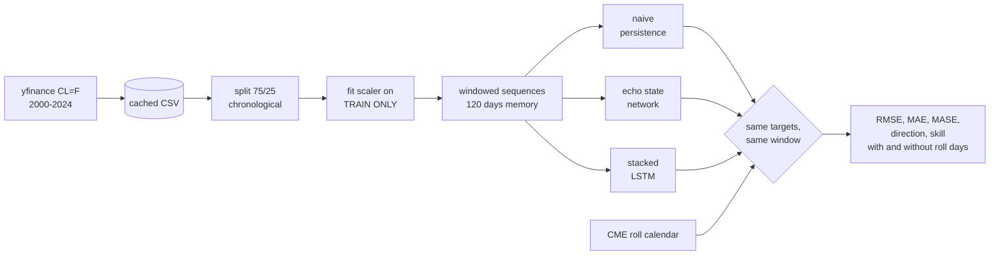

# WTI Crude Forecasting: LSTM vs. Echo State Network

[](https://github.com/vincal848/oil_price_prediction/actions/workflows/tests.yml)

For this project I was working from my coursework series in mathematical computing,
and I wanted to use neural networks on a price series. I took WTI Crude Oil Futures
(`CL=F`) and compared an LSTM against an Echo State Network reservoir model. My
reasoning for choosing a recurrent architecture over feedforward and convolutional
networks is in [docs/METHODS.md](docs/METHODS.md), along with the gate equations and
what the reservoir is actually doing.

I have since rebuilt it, and the conclusion changed. The original compared the two
models against each other and found the LSTM won. It did — but I never checked either
of them against the obvious benchmark, which is predicting that tomorrow's price is
today's price. **Both models lose to that benchmark, badly.** Everything below is the
work of establishing that.


*The naive forecast is on this chart. It is the grey line, and you cannot see it,
because it sits underneath the actual price for the entire window. That is the whole
problem with judging a one-step-ahead price model by eye.*

## At a glance

| | |
|---|---|
| **Data** | WTI front-month continuous (`CL=F`), 2000-08-30 to 2024-05-30, 5,962 daily closes |
| **Models** | Naive persistence; Echo State Network (ReservoirPy); stacked LSTM (TensorFlow) |
| **Split** | 75% train, chronological. Evaluation 2018-12-18 to 2024-05-30, 1,371 days |
| **Task** | One-step-ahead close, 120 trading days of memory |
| **Metrics** | RMSE, MAE, MASE, directional accuracy, skill vs. persistence |
| **Result** | Neither model beats persistence. LSTM 50% worse on RMSE, ESN 158% worse |
| **Stack** | Python, TensorFlow, ReservoirPy, scikit-learn, pandas |

## Results

| model | RMSE | MAE | MASE | directional accuracy | seconds |
|---|---|---|---|---|---|
| **naive persistence** | **2.71** | **1.36** | **1.35** | — | 0.0 |
| LSTM | 4.06 | 2.82 | 2.80 | 0.477 | ~94 |
| echo state network | 7.00 | 5.12 | 5.09 | 0.498 | ~0.05 |

Skill against persistence, where positive would mean an improvement:

| model | RMSE skill | MAE skill |
|---|---|---|
| LSTM | −0.496 | −1.077 |
| echo state network | −1.580 | −2.766 |

Three things follow from this.

**The LSTM does beat the ESN,** which is what the original concluded, and that part
holds up. It is about 42% better on RMSE. The reservoir, though, fits in a
twentieth of a second against the LSTM's ninety-odd -- three orders of magnitude,
which is the whole point of a fixed random reservoir with a trained readout. Here
it pays for that speed with a much noisier forecast.

**Neither beats doing nothing.** Persistence gets RMSE 2.71; the LSTM 4.06. A model
that costs 94 seconds of training and produces a worse forecast than copying
yesterday's number is not a model I would trade on. MASE says the same thing in
scale-free terms: both are well above 1.

**Neither has directional skill.** 0.477 and 0.498 against a coin flip. Level accuracy
on a near-random-walk is easy to obtain and tells you almost nothing, because most of
tomorrow's price is today's price. The direction of the move is the part with the
information in it, and neither model has any.


## Does the contract roll explain this?

`CL=F` is a continuous front-month series: when the front contract expires, Yahoo
splices the series onto the next one. The day-over-day change across a splice mixes a
real price move with the spread between two different contracts, and nothing can
forecast the second part. That is a genuine defect in the data and it was worth asking
whether it was compressing the comparison.

I derived the roll dates from the CME contract rule rather than detecting them from
the data, so they are known in advance and cannot be fitted to whatever happens to
look like a jump. The rule is three business days before the 25th of the month
preceding delivery, or four if that 25th is not a business day. The implementation is
checked against eight published termination dates in the test suite.

| | |
|---|---|
| Roll days | 285 of 5,961 (4.8%), 66 of them in the evaluation window |
| Mean absolute change, roll days | $1.34 |
| Mean absolute change, other days | $1.07 |
| Volatility ratio | 1.24× |
| Share of total variance | 5.3% |

So the roll is real, and roll days are about a quarter more volatile than ordinary
ones. But 4.8% of days carrying 5.3% of variance is barely over-represented, and
removing them does not change anything:

| model | RMSE skill, all days | RMSE skill, excluding roll days |
|---|---|---|
| LSTM | −0.496 | −0.485 |
| echo state network | −1.580 | −1.528 |

The roll moves the answer by about one percentage point. It is not what is compressing
the comparison. What compresses it is the task: one-step-ahead prediction of something
close to a random walk, where the benchmark is already most of the way to the answer.

A related point worth recording. I assumed the −$37.63 close on 2020-04-20 was a roll
artefact. It is not — it falls the day *before* that contract's termination, and
FRED's Cushing spot series, which has no contract and therefore no roll, went negative
the same day at −$36.98. That was a genuine collapse in the expiring contract under a
storage shortage, and no model here anticipates it.


## What was wrong

**The scaler was fit on the whole series before the split.** This is the one that
matters most. `MinMaxScaler` was fitted on all 5,962 observations and only then split
into train and validation, so the normalization of every training row depended on the
full-sample minimum and maximum. That minimum is −$37.63 from 2020-04-20 — a date
inside the validation set.

```
scaler fitted on ALL data   : min=  -37.63  max= 145.29
scaler fitted on TRAIN only : min=   17.45  max= 145.29
```

Fitting on the training window only moves the minimum by 55 dollars. Every training
row had been scaled by a future event.

**The two models were scored over different periods.** The reservoir was evaluated
from `val_data[1:]` and the LSTM from `val_data[120:]`, so their error numbers
described different windows and were never comparable. They now share an evaluation
window by construction, and a test pins it.

**There was no benchmark.** Covered above. This is the one that changed the finding.

**MAPE was reported on a window containing a negative price.** MAPE divides by the
actual value. With −$37.63 in the window the division changes sign, and the days
around it in the low teens blow the ratio up. The number the original printed was not
interpretable. MASE replaces it, which is scale-free and defined at and below zero.

**NRMSE flattered every model.** Its denominator is the range of the actual values,
and in this window that range is set by the −$37.63 print. One outlier in the
denominator makes everything look better than it is.

**`EarlyStopping(patience=10)` with `epochs=6`** could never trigger, since the
patience exceeded the total number of epochs. The callback was decoration.

**The test set was passed as `validation_data`** during training and then scored on.

**`fb_connectivity=1.1`** is a connection density, so it belongs in [0, 1] — and the
model was wired `reservoir >> readout` with no feedback path for it to apply to.

The original file is kept at [legacy/oil_price_prediction.py](legacy/oil_price_prediction.py),
annotated. It no longer runs anyway: ReservoirPy 0.4 removed `reservoirpy.verbosity`
and the `bias_scaling` and `fb_connectivity` arguments it passes.

## How it works



## Decisions

- **Persistence is the benchmark, not the ESN.** Comparing two models to each other
  answers which is better; it does not answer whether either is any good. On a price
  series the naive forecast is strong enough that it has to be the reference.
- **MASE instead of MAPE.** Forced by the data: a percentage error needs a strictly
  positive denominator and this series has a negative one.
- **Directional accuracy is reported as undefined for persistence.** A flat forecast
  makes no directional call at all. Scoring it against the realised sign returns
  0.000, which reads as perfectly anti-predictive rather than as silent.
- **Roll dates from the CME rule, not from the data.** Detecting jumps and calling
  them rolls would be fitting the diagnosis to the symptom.
- **Both models see identical windows.** They are given the same inputs and scored on
  the same targets, so any difference is the model rather than the setup.
- **Everything is seeded.** Two runs give the same numbers.

## Quick start

```bash
pip install -r requirements.txt
```

```bash
python run.py
```

```
Evaluation window: 2018-12-18 to 2024-05-30  (1371 days, memory 120)
model                     rmse          rmse_ex_roll                   mae           mae_ex_roll                  mase  directional_accuracy               seconds
naive                   2.7134                2.7510                1.3602                1.3604                1.3505                   nan                0.0000
esn                     7.0013                6.9543                5.1217                5.0922                5.0853                0.4982                0.0539
lstm                    4.0594                4.0861                2.8244                2.8360                2.8044                0.4769               94.3368

roll: 285 of 5961 days (4.8%), 1.24x the mean absolute change of other days, 5.3% of total variance. 66 fall in the evaluation window.

skill vs naive persistence (positive = better than repeating today's price)
  esn    RMSE -1.5803   MAE -2.7655   RMSE excluding roll days -1.5279
  lstm   RMSE -0.4961   MAE -1.0765   RMSE excluding roll days -0.4853
```

Other options:

```bash
python run.py --window 60    # the memory length I tried first
python run.py --no-lstm      # skip TensorFlow, runs in about a second
pytest tests -q              # 27 tests, no network and no TensorFlow needed
```

The first run downloads from Yahoo and caches to `data/wti.csv`, so later runs are
offline and reproducible.

## Repository guide

| Path | Contents |
|---|---|
| `data.py` | Download and cache, chronological split, leak-free scaling, windowing |
| `models.py` | The three forecasters, each returning predictions in dollars |
| `metrics.py` | RMSE, MAE, MASE, directional accuracy, skill scores, and why MAPE is gone |
| `roll.py` | CME termination dates and what the contract roll costs |
| `run.py` | The experiment, the printed table, `results/` and the figures |
| `tests/` | 27 tests, including a regression for each defect above |
| `docs/METHODS.md` | My original write-up: why an RNN, the LSTM gates, the reservoir |
| `legacy/` | The original script, annotated. Does not run on current dependencies |

## Future interests

- **Forecast returns, not levels.** Predicting the level of a near-random-walk is a
  task where the benchmark is nearly unbeatable by construction. Returns are the
  honest framing and would make the comparison mean something.
- **A horizon longer than one day**, where persistence weakens and a model has room to
  add value.
- **Exogenous inputs** — inventories, the term structure, the dollar — since a
  univariate price series has little left in it after the last observation.
- **Modelling based on *Virtual Barrels* by Dr. Ilia Bouchouev**, which is where I
  wanted to take this originally and is a better frame for oil specifically than a
  generic sequence model.
- **A roll-adjusted continuous series**, built from individual contract months rather
  than Yahoo's spliced one. Yahoo does not serve expired contracts, so this needs a
  different data source.

## Notes

- ESN hyperparameters follow Kumar K. (2023), as in the original.
- `CL=F` is Yahoo's continuous front-month series. See the roll section for what that
  implies; it is not a roll-adjusted series.
- Timings are single-core on one machine and vary between runs; they are there for
  the order-of-magnitude comparison. Every accuracy figure is seeded and stable.
- All numbers in this README come from `python run.py` and are reproduced in
  `results/metrics.json`.
